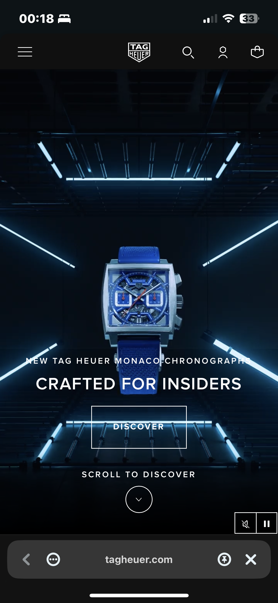
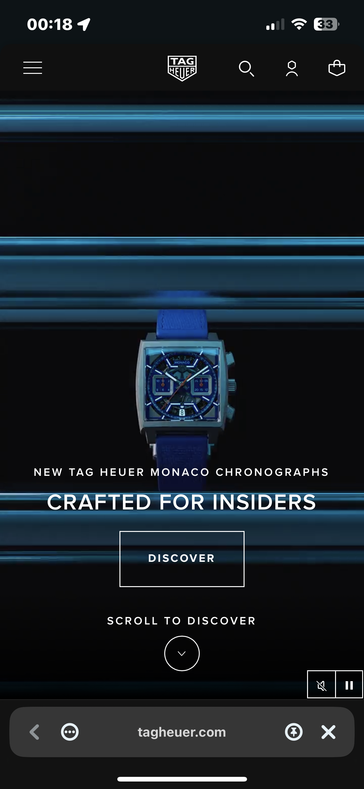
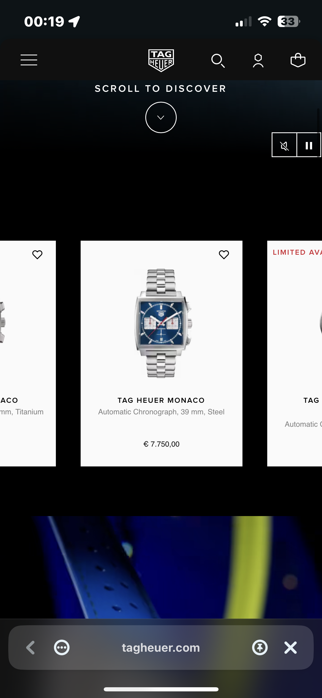
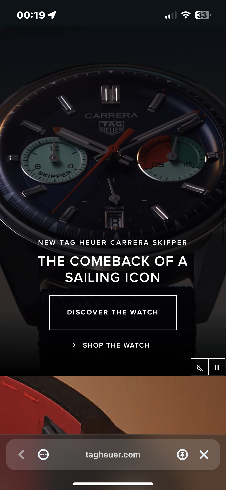
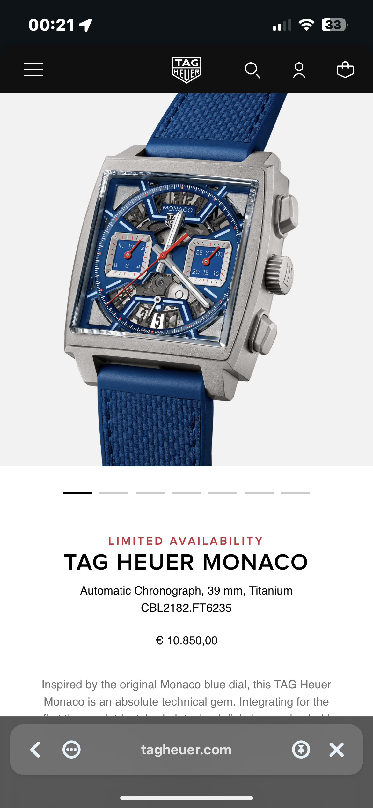
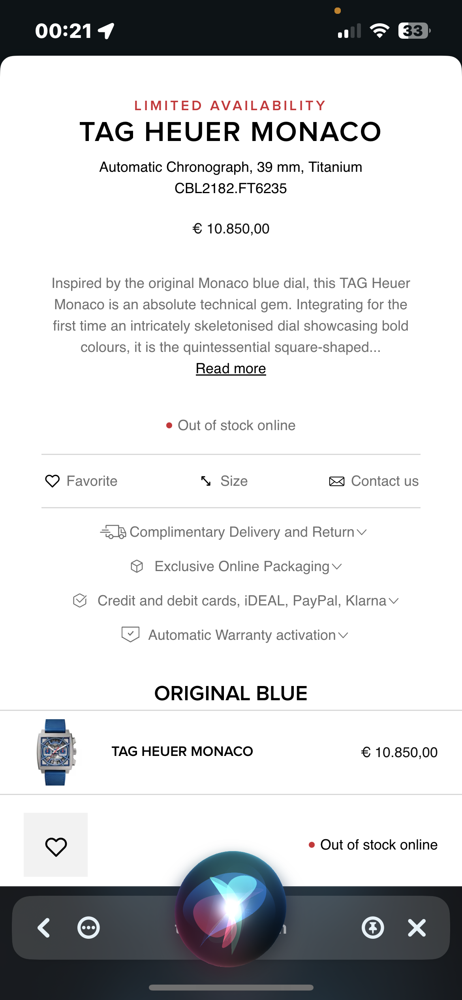
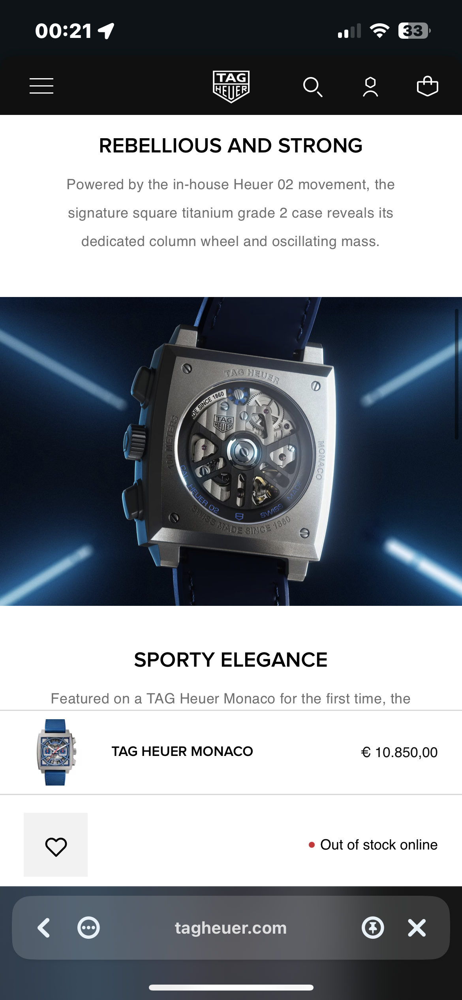
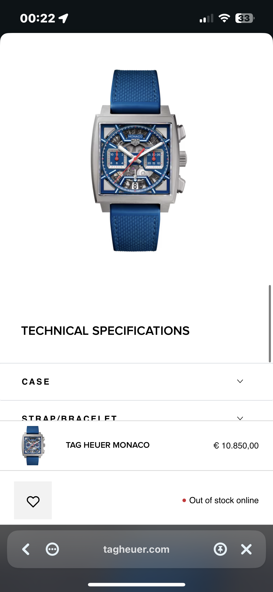
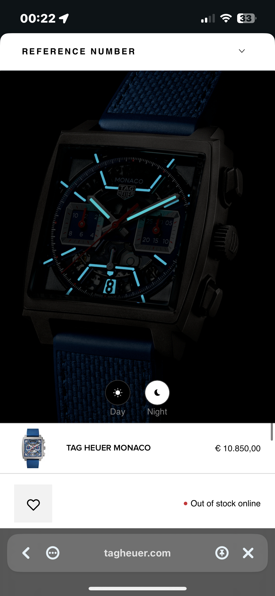

# Procesverslag
Markdown is een simpele manier om HTML te schrijven.  
Markdown cheat cheet: [Hulp bij het schrijven van Markdown](https://github.com/adam-p/markdown-here/wiki/Markdown-Cheatsheet).

Nb. De standaardstructuur en de spartaanse opmaak van de README.md zijn helemaal prima. Het gaat om de inhoud van je procesverslag. Besteedt de tijd voor pracht en praal aan je website.

Nb. Door *open* toe te voegen aan een *details* element kun je deze standaard open zetten. Fijn om dat steeds voor de relevante stuk(ken) te doen.

## Jij

  
uitwerken voor kick-off werkgroep

  ### Auteur:
  Mike de Vries

  #### Je startniveau:
  Hoogstwaarschijnlijk Niv. 'Zwart' om echt het maximale uit dit vak te halen, maar in geval van nood of tijdgebrek door prive Niv. 'Rood'.

  #### Je focus:
  Surface Plane
 

## Je website

  
uitwerken voor kick-off werkgroep

  ### Je opdracht:
  Pagina 1:
  https://www.tagheuer.com/nl/en/

  Pagina 2:
 https://www.tagheuer.com/nl/en/timepieces/collections/tag-heuer-monaco/39-mm-calibre-heuer-02-automatic/CBL2182.FT6235.html

  #### Screenshot(s) van de eerste pagina (small screen): 
  Homepage Tag Heuer
  
  
  
  
  
  

  #### Screenshot(s) van de tweede pagina (small screen):
  Shoppage Tag Heuer Watch  

  
  
  
  
  
  

 

## Toegankelijkheidstest 1/2 (week 1)

  
uitwerken na test in 2e werkgroep

  ### Bevindingen
  Lijst met je bevindingen die in de test naar voren kwamen:
  <ul>
    <li>Tag Heuer horloge detailpagina skipt met tab wat content die het horloge moet toelichten. </li>
    <li>Tag Heuer homepagina is vrij groed tab-baar. Goede volgorde en blangrijke elementen als: winkelmandje uitvouwen, shopping cart openen, light en dark mode activation voor afbeelding.</li>
    <li>Videos hebben controls om audio uit/aan te zetten en te pauzeren.</li>
    <li>Soms tijdens tabben is er geen visible focus, het lijkt dat of hij iets wilt focussen wat op de achtergrond aanwezig is maar niet in zicht.</li>
    <li>Website is visueel, hier en daar, niet echt toegangelijk. De stijl is aan de minimalistische kant.</li>
  </ul>

## Breakdownschets (week 1)

  
uitwerken na afloop 3e werkgroep

  ### de hele pagina: 
  

  ### dynamisch deel (bijv menu): 
  

  ### wellicht nog een dynamisch deel (bijv filter): 
  

## Voortgang 1 (week 2)

  
uitwerken voor 1e voortgang

  ### Stand van zaken
  hier dit ging goed & dit was lastig (neem ook screenshots op van delen van je website en code)

Html is niet zo  moeilijk voor mij. Alleen qua hierarchie wat vragen gehad voor danny in de les, voor wanneer ik een h3 zou gebruiken ipv een p of een span etc.

  ### Agenda voor meeting
  samen met je groepje opstellen

  | student 1      | student 2          | student 3    | student 4        |
  | ---            | ---                | ---          | ---              |
  | dit bespreken  | en dit             | en ik dit    | en dan ik dat    |
  | en dat ook nog | dit als er tijd is | nog een punt | dit wil ik zeker |
  | ...            | ...                | ...          | ...              |

Vragen:
Hoe zal ik de buttons doen van de video hoe werkt dat qua js en vormgeving daarvan.
Wrs easy maar nog niet in verdiept. Haal je bepaalde feartues op uit de video om die controls aan te zetten en hoe target je deze dan om vorm te geven?

Even snel.. dit heb ik binne 1 sec wrs gevonden op internet, maar hoe maak je ook al weer deze products scrollable horizontaal, heeft het dan nog een toegevoegde waarde om ze te laten snappen per item?

Hoe zou jij doen dat als ik een item verder ga hij de progressie aangeeft, met JS?

Hoe werkt het met de openvouwende footer onderdelen?
Hoe vouwen die mooi open? wat is het engels woord voor die functionaliteit.
Tips?

  ### Verslag van meeting
  hier na afloop snel de uitkomsten van de meeting vastleggen

  - punt 1
  - punt 2
  - nog een punt
  - ...

## Voortgang 2 (week 3)

  
uitwerken voor 2e voortgang

  ### Stand van zaken
  hier dit ging goed & dit was lastig (neem ook screenshots op van delen van je website en code)

  ### Agenda voor meeting
  samen met je groepje opstellen

  | student 1      | student 2          | student 3    | student 4        |
  | ---            | ---                | ---          | ---              |
  | dit bespreken  | en dit             | en ik dit    | en dan ik dat    |
  | en dat ook nog | dit als er tijd is | nog een punt | dit wil ik zeker |
  | ...            | ...                | ...          | ...              |

  ### Verslag van meeting
  hier na afloop snel de uitkomsten van de meeting vastleggen

  - punt 1
  - punt 2
  - nog een punt
- ...

## Toegankelijkheidstest 2/2 (week 4)

  
uitwerken na test in 9e werkgroep

  ### Bevindingen
  Lijst met je bevindingen die in de test naar voren kwamen (geef ook aan wat er verbeterd is):

## Voortgang 3 (week 4)

  
uitwerken voor 3e voortgang

  ### Stand van zaken
  hier dit ging goed & dit was lastig (neem ook screenshots op van delen van je website en code)

  ### Agenda voor meeting
  samen met je groepje opstellen

  | student 1      | student 2          | student 3    | student 4        |
  | ---            | ---                | ---          | ---              |
  | dit bespreken  | en dit             | en ik dit    | en dan ik dat    |
  | en dat ook nog | dit als er tijd is | nog een punt | dit wil ik zeker |
  | ...            | ...                | ...          | ...              |

  ### Verslag van meeting
  hier na afloop snel de uitkomsten van de meeting vastleggen

  - punt 1
  - punt 2
  - nog een punt
  - ...

## Eindgesprek (week 5)

  
uitwerken voor eindgesprek

  ### Je uitkomst - karakteristiek screenshots:
  

  ### Dit ging goed/Heb ik geleerd: 
  Korte omschrijving met plaatjes

  

  ### Dit was lastig/Is niet gelukt:
  Korte omschrijving met plaatjes

  

## Bronnenlijst

  
continu bijhouden terwijl je werkt

  Nb. Wees specifiek ('css-tricks' als bron is bijv. niet specifiek genoeg). 
  Nb. ChatGpT en andere AI horen er ook bij.
  Nb. Vermeld de bronnen ook in je code.

  1. bron 1
  2. bron 2
  3. ...

